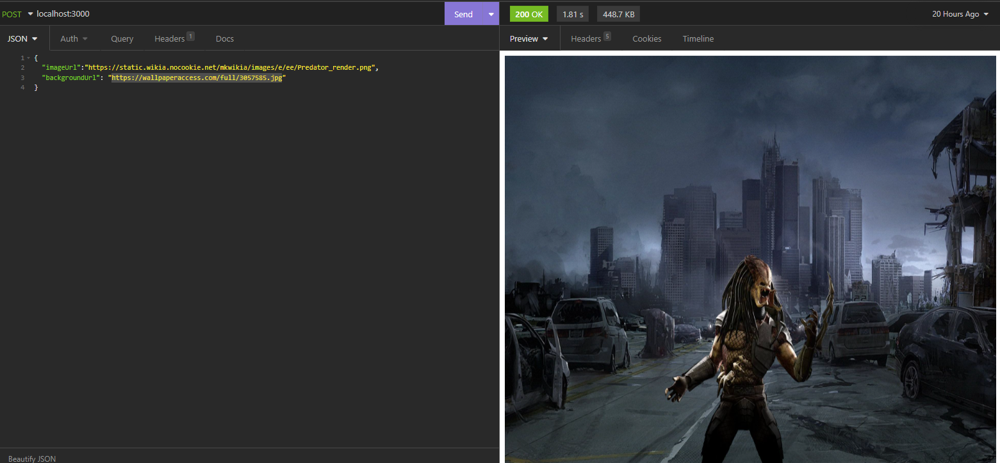

# Processing image to add background with worker threads Nodejs

- Some times when we create api's, we dont care about load processing. And it can blocking the main process that execute requests.

- In this repository, i've been created an api using worker threads to not blocking the event loop and main process of aplication.

# Goas of aplication

- This api generate an image composite by two other images.

- Example: 

# Techs and Libs

- Sharp (processing image)
- Axios (requesting)
- yup (data validation)
- Worker threads (core nodejs)

# Scripts
 - npm run test (run unit tests)
 - npm start (open http server)
 - sh script.sh (to make load test with autocannon)